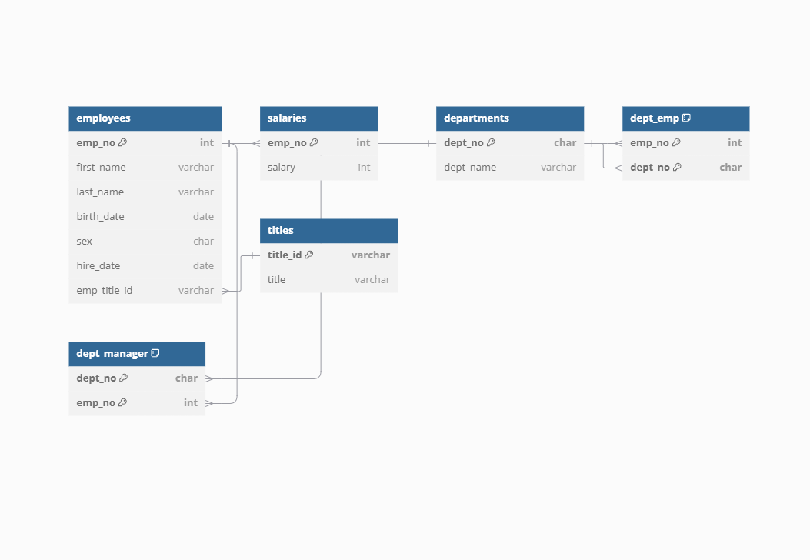

# sql-challenge
## Entity Relationship Diagram (ERD)

Pewlett Hackard Analysis Project
Project Overview
This project is a research analysis for Pewlett Hackard (a fictional company) to study employees who worked during the 1980s and 1990s. The dataset consists of CSV files containing employee data, and the project involves data modeling, data engineering, and data analysis.

The goal is to:

Create a relational database schema to hold the data.
Import the data into a PostgreSQL database.
Answer business-related questions using SQL queries.
Project Structure
bash
Copy code
EmployeeSQL/
│
├── ERD.png               # Entity-Relationship Diagram for the database
├── table_schemas.sql     # SQL script to create database tables
├── queries.sql           # SQL script containing analysis queries
├── csv_data/             # Folder containing the source CSV files
│   ├── employees.csv
│   ├── salaries.csv
│   ├── titles.csv
│   ├── departments.csv
│   ├── dept_emp.csv
│   ├── dept_manager.csv
└── README.md             # Documentation for the project
Steps to Complete the Project
1. Data Modeling
An Entity-Relationship Diagram (ERD) was created to visualize the relationships between the tables. The ERD is included as ERD.png.
Key relationships:
Each employee has one or more salaries (employees → salaries).
Employees belong to departments (dept_emp).
Departments have managers (dept_manager).
Each employee is assigned a title (employees → titles).
2. Data Engineering
The table schemas were created based on the ERD using table_schemas.sql.
Steps:
Tables were created with appropriate data types, primary keys, foreign keys, and constraints.
Data was imported from the CSV files into the PostgreSQL database using the COPY command.
3. Data Analysis
Analysis was performed using SQL queries to answer the following questions:
Employee details along with their salaries.
Employees hired in 1986.
Managers of each department.
Employees belonging to each department.
Employees with specific names and conditions.
Frequency of employee last names.
Prerequisites
PostgreSQL installed on your machine.
pgAdmin or psql for running SQL commands.
How to Set Up the Database
Clone this repository:

git clone <repository-url>
cd EmployeeSQL
Create the database in PostgreSQL:

Create a database named employees_db.
Open the table_schemas.sql file in pgAdmin or psql and execute it to create the tables.

Import the CSV data into the respective tables using the COPY command.

Repeat the import process for all CSV files.

Git and GitHub: For version control and collaboration.
Author
[Nathaniel Trief]
Pewlett Hackard Data Engineering Team

*Code created using the assistance of ChatGPT code Copilot*